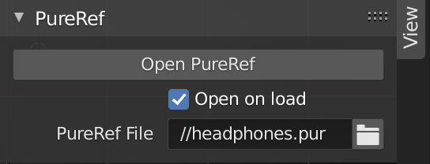

# PureRef Manager

## A simple addon
to open PureRef Files from within blender.
With the option to auto-open PureRef files on loading a blend file. The 'Manager' naming is a bit overambitious.

## Settings
are in the "View" tab in the N-Panel in the 3D-Editor.

If the PureRef File is not set the project folder is searched for PureRef files.
The alphabetically last file is then opened.

If your PureRef files are incrementally numbered and you want the last one or if you only have one you do not have to set the file. The filename is only to be set if you have multiple files and want to load a specific one.

Either use the button to open PureRef or check the Open on Load box to automatically open PureRef when opening this blender file.

## Either
clone the repo into your user-addons-dir

or download the latest zip from the <a href="https://github.com/florianfelix/pureref_manager/releases">releases</a> and install normally.

